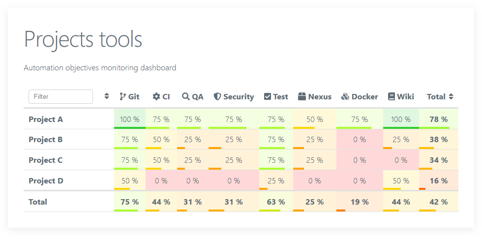

# Objectives monitoring


A simple tool to display a dashboard of objectives from a YAML data file.

> :construction: Experimental tool :construction:

## Install

Install the tool:

```shell
npm install GaelGirodon/objmon
sh build.sh
npm link
```

Once installed, run `objmon --help` for further instructions.

## Usage

Generate and serve a dashboard from a YAML data file:

```shell
objmon serve <data.yml> [--watch]
```

Browse the dashboard at <http://localhost:3000>.

## Data file format

```yaml
title: Dashboard title        # Dashboard display title
subtitle: Dashboard subtitle  # Dashboard display subtitle

objectives:                   # List of objectives
  - id: objective-1           # Unique identifier
    name: Objective 1         # Display name
    icon: code-branch         # Font Awesome 5 solid icon (optional)
    description: Description  # Description (optional)
  - [...]

subjects:                     # List of subjects (e.g. projects)
  - id: subject-1             # Unique identifier
    name: Subject 1           # Display name
    url: https://...          # Associated URL (e.g. project URL)
    objectives:               # Tracked objectives by id (optional)
      objective-1: 75         # Objective progress (optional)
      objective-2:            # Detailed objective progress (optional)
        progress: 25          # - Progress (optional)
        comment: Comment      # - Comment (optional)
      [...]
  - [...]
```

## Example



## License

**objmon** is licensed under the GNU General Public License.
